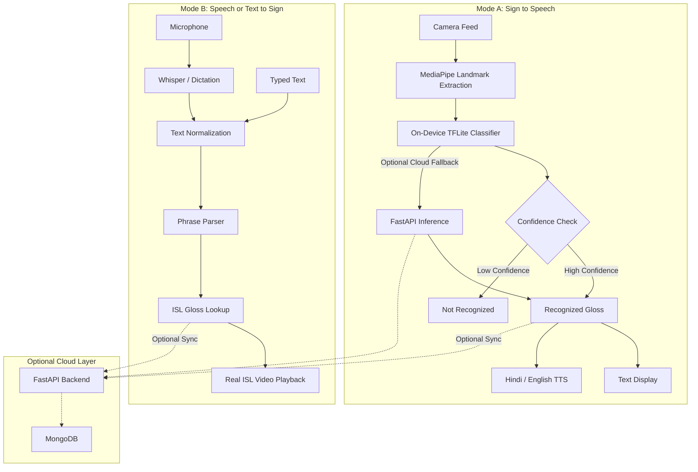

# 🤟 SignBridge

### Two-Way Real-Time Communication Bridge for Indian Sign Language, Speech, and Text

<p align="center">
  
  
  
  
  
  
</p>

<p align="center"><b>Built for the Bit & Build Hackathon — Track 1: ACCESS</b></p>

---

## 💡 What is SignBridge?

Communication should work in both directions.

Most accessibility tools solve half the problem:

```text
Speech → Text     ✓
Sign → Speech     ?
```

A Deaf or hard-of-hearing user can often *read* what a hearing person says thanks to speech-to-text. But when it's their turn to respond, the loop breaks — there's rarely a convenient way to turn their sign back into speech or text the other person understands.

**SignBridge closes that loop.** It's a two-way communication bridge:

```text
Deaf User                              Hearing User

Sign ─────────────────────────►  Speech / Text
                 ◄─────────────
Speech / Text ─────────────────► ISL Video
```

> **Make everyday communication more accessible, independent, and inclusive.**

---

## ♿ Track 1: ACCESS — The Problem

Communication barriers between Deaf/hard-of-hearing individuals and people who don't know Indian Sign Language (ISL) show up constantly:

- 🏥 Healthcare
- 🏫 Education
- 💼 Employment and interviews
- 🚌 Public transportation
- 🏛️ Government services
- 🛍️ Everyday shopping and services
- 🚨 Emergency situations

In each of these, speech-to-text can help a Deaf person understand what's being said — but it doesn't give them a way to respond in kind. SignBridge exists to close that gap.

---

## 🚀 Our Solution

### Mode A — Sign → Speech / Text

The Deaf user signs in front of the camera. MediaPipe extracts hand and pose landmarks, an on-device classifier recognizes the gesture, and the result is shown as text and spoken aloud in Hindi or English.

### Mode B — Speech / Text → Sign

The hearing user speaks or types. Speech is transcribed (Whisper / platform dictation), normalized, and mapped to an ISL gloss sequence, which plays back as **real bundled ISL demonstration videos** — not a synthetic avatar.

---

## ✨ Key Features

| Feature | Description |
|---|---|
| 🔁 Two-Way Communication | Sign → Speech/Text and Speech/Text → Sign |
| 🤟 ISL Recognition | Camera-based recognition using hand and pose landmarks |
| 🎙️ Speech Recognition | Converts spoken Hindi and English into text |
| 🔊 Text to Speech | Converts translated responses into spoken language |
| 🎬 ISL Video Playback | Real ISL demonstrations, not synthetic animation |
| 🇮🇳 Hindi and English | Bilingual speech and text workflows |
| 📴 Offline Capable | Core recognition and playback work without internet |
| 🛡️ Confidence Aware | Never presents an uncertain prediction as a confirmed sign |
| 📚 163-Sign Vocabulary | Alphabet, numbers, common phrases, emergency terms |
| 📝 Conversation History | Optional session storage via the backend |

---

## 🏗️ System Architecture



---

## 🛡️ Responsible AI — No Fake Signs

> **If the system doesn't know, it says so.**

Incorrect communication is especially harmful in accessibility contexts, so SignBridge holds to three rules:

1. **Low-confidence recognition** — if a gesture doesn't clear the confidence threshold, the system reports "sign not recognized" instead of silently guessing.
2. **Unreliable speech input** — if audio can't be transcribed reliably, the app surfaces an honest fallback rather than an invented transcript.
3. **Real demonstrations only** — every sign shown for Speech/Text → Sign comes from a verified ISL video in the bundled dataset, never a generated animation.

---

## 🏥 Real-World Example: Hospital Communication

A Deaf patient visits a hospital where the staff member doesn't know ISL.

1. The staff member speaks — SignBridge converts it to readable text for the patient.
2. The patient responds in ISL — SignBridge recognizes the sign and converts it to text and speech.
3. The staff member hears the response, and the conversation continues without either person needing to learn the other's communication method.

---

## 📁 Project Structure

```text
SignBridge/
├── app/
│   ├── lib/
│   │   ├── features/
│   │   │   ├── sign_to_speech/
│   │   │   └── speech_to_sign/
│   │   ├── services/
│   │   │   ├── camera/
│   │   │   ├── tts/
│   │   │   ├── stt/
│   │   │   └── video_player/
│   │   └── main.dart
│   └── pubspec.yaml
│
├── backend/
│   ├── routers/
│   ├── models/
│   ├── requirements.txt
│   └── main.py
│
├── signbridge_isl_model/
│   ├── landmark_classifier.tflite
│   └── train.py
│
├── dataset/
│   ├── videos/
│   └── lexicon.json
│
├── START_SIGNBRIDGE.bat
└── README.md
```

---

## ⚙️ Technology Stack

| Technology | Purpose |
|---|---|
| Flutter | Cross-platform application |
| Python | ML and backend development |
| FastAPI | Backend and optional cloud inference |
| MediaPipe | Hand and pose landmark extraction |
| TensorFlow Lite | On-device gesture classification |
| Whisper / faster-whisper | Speech recognition |
| MongoDB | Optional conversation history |
| FFmpeg | Audio and video processing |

---

## 📥 Installation

> [!NOTE]
> Setup instructions and download link coming soon.

---

## 🔌 API Reference

| Method | Endpoint | Description |
|---|---|---|
| `POST` | `/speech-to-isl` | Convert audio into an ISL gloss sequence |
| `POST` | `/text-to-isl` | Convert Hindi or English text into an ISL gloss sequence |
| `POST` | `/predict` | Predict a gesture from landmark data |
| `GET` | `/vocabulary` | Retrieve the supported sign vocabulary |
| `GET` | `/history` | Retrieve conversation history |

> [!NOTE]
> `/predict`, `/vocabulary`, and core sign playback work fully offline. `/speech-to-isl`, `/text-to-isl`, and `/history` require the optional FastAPI backend.

---

## 📴 Offline Capability

Core functionality doesn't depend on the cloud:

```text
Camera → Local Landmark Processing → Local Classifier → Local Vocabulary → Local Video Playback
```

The backend is optional and adds cloud inference fallback, conversation sync, and session history.

---

## 📊 Current Scope

SignBridge is a **hackathon prototype** with a fixed vocabulary of **163 signs** — alphabet, numbers, common expressions, everyday communication, and selected emergency terms.

Recognition performance can vary with lighting, camera quality, hand positioning, signing speed, background conditions, user variation, and whether a gesture is in the supported vocabulary. Signs outside that vocabulary won't be recognized.

SignBridge is a technology prototype aimed at improving everyday accessibility — it is not a replacement for professional ISL interpreters.

---

## 🔮 Future Roadmap

1. **Larger ISL vocabulary** — cover substantially more everyday communication.
2. **Continuous sign recognition** — move beyond single gestures to full sentences.
3. **Improved language processing** — richer ISL gloss mapping for complex phrases.
4. **More robust recognition** — better performance across users, angles, and environments.
5. **Community validation** — work directly with Deaf users, ISL experts, and accessibility organizations.
6. **Real-world deployment** — hospitals, schools, workplaces, government offices, public transport.

The long-term goal is to build this **with** the Deaf community, not simply for it.

---

## 🌍 Expected Impact

- **Independence** — less reliance on a third party for basic communication.
- **Accessibility** — communication support where ISL interpreters aren't immediately available.
- **Inclusion** — Deaf and hearing users participating naturally in the same conversation.
- **Privacy** — fewer situations where sensitive information has to pass through a friend or family member acting as interpreter.

---

## 🏆 Bit & Build Hackathon — Track 1: ACCESS

**Challenge:** Identify a genuine accessibility problem faced by people with disabilities in India and build an innovative solution.

**Our problem:** Communication barriers between Deaf/hard-of-hearing individuals and people who don't know ISL.

**Our solution:** A two-way bridge connecting ISL, text, and speech.

> Accessibility shouldn't stop at understanding. Everyone should have a way to communicate and be heard.

---

## 👥 Team

*Add your team members here.*

---

## 📜 License

MIT License. See `LICENSE` for details.
